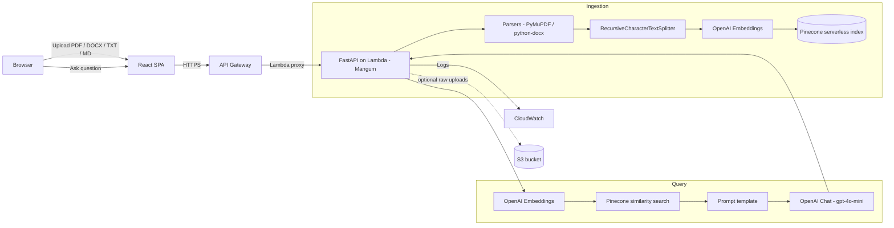

# DocuMind

> Retrieval-Augmented Document Q&A service. Upload private documents, then
> ask natural-language questions over them and get grounded, cited answers.

DocuMind is a small but production-ready RAG stack:

- **Backend:** FastAPI + LangChain LCEL chain
- **Vector DB:** Pinecone (serverless)
- **Embeddings / LLM:** OpenAI (`text-embedding-3-small` + `gpt-4o-mini`, both configurable)
- **Frontend:** React + Vite SPA with file-upload and chat UI
- **Infra:** Terraform-provisioned AWS Lambda + API Gateway + S3
- **CI/CD:** GitHub Actions (lint + test on PR, deploy on merge to `main`)
- **Local dev:** Docker Compose

---

## Architecture



The same FastAPI app runs in three places without code changes: locally via
`uvicorn` (or Docker), on AWS Lambda via the `Mangum` ASGI adapter, and inside
`pytest` via `httpx.TestClient`.

---

## Folder layout

```
documind/
├── backend/
│   ├── app/
│   │   ├── main.py               # FastAPI app + Mangum handler
│   │   ├── config.py             # Pydantic settings
│   │   ├── routers/              # /ingest, /query, /health
│   │   ├── services/             # ingestion, retrieval, llm, pinecone client
│   │   └── utils/parsers.py      # PDF / DOCX / TXT / MD -> plain text
│   ├── tests/                    # pytest unit tests
│   ├── lambda_handler.py         # AWS Lambda entrypoint
│   ├── Dockerfile
│   └── requirements.txt
├── frontend/                     # React + Vite SPA
├── terraform/                    # AWS infra (Lambda, API GW, IAM, S3)
├── .github/workflows/            # CI + deploy pipelines
├── docker-compose.yml
├── .env.example
└── README.md
```

---

## Prerequisites

- Python 3.11
- Node 20
- Docker + Docker Compose
- Terraform >= 1.5
- AWS CLI v2, configured with credentials that can create Lambda / API GW / IAM / S3
- A Pinecone account (free serverless tier is fine)
- An OpenAI API key

---

## Local development

```bash
git clone <your-fork-url> documind
cd documind
cp .env.example .env
# Open .env and fill OPENAI_API_KEY, PINECONE_API_KEY, PINECONE_INDEX_NAME

docker-compose up --build
```

Once the stack is healthy:

- Frontend: <http://localhost:3000>
- Backend:  <http://localhost:8000>
- Swagger UI: <http://localhost:8000/docs>
- Health:    <http://localhost:8000/health>

### Without Docker

```bash
# Backend
cd backend
python -m venv .venv && source .venv/bin/activate
pip install -r requirements.txt
uvicorn app.main:app --reload --port 8000

# Frontend (new shell)
cd frontend
npm install
VITE_API_BASE_URL=http://localhost:8000 npm run dev
```

---

## Pinecone setup (one-time)

DocuMind expects an existing Pinecone index. Create one via the console or API:

- **Name:** `documind` (or whatever you set in `PINECONE_INDEX_NAME`)
- **Type:** Serverless
- **Cloud / region:** match your `PINECONE_ENVIRONMENT` (e.g. AWS `us-east-1`)
- **Dimension:** `1536` (matches `text-embedding-3-small`)
- **Metric:** `cosine`

If you change the embedding model to one with a different output size, also
update `EMBEDDING_DIMENSION` in `backend/app/config.py` and recreate the index.

---

## Running tests

```bash
cd backend
pip install -r requirements.txt
pytest -q
```

Tests are fully offline: OpenAI embeddings, OpenAI chat, and Pinecone are all
monkey-patched. CI runs the same suite on every PR.

---

## API reference

### `GET /health`

```bash
curl http://localhost:8000/health
# {"status":"ok","version":"1.0.0"}
```

### `POST /ingest` — upload + index a document

```bash
curl -X POST http://localhost:8000/ingest \
  -F "file=@./policy.pdf" \
  -F "namespace=acme-handbook"
```

```json
{
  "status": "success",
  "chunks_ingested": 42,
  "namespace": "acme-handbook",
  "filename": "policy.pdf"
}
```

Errors:

| Status | When                                                            |
| ------ | --------------------------------------------------------------- |
| 400    | Unsupported extension, empty file, unparseable file             |
| 413    | File exceeds `MAX_FILE_SIZE_MB`                                 |
| 500    | Embedding or Pinecone upsert failed                             |

### `POST /query` — ask a question

```bash
curl -X POST http://localhost:8000/query \
  -H "Content-Type: application/json" \
  -d '{
        "question": "What is the refund policy?",
        "namespace": "acme-handbook",
        "top_k": 5
      }'
```

```json
{
  "answer": "The refund policy allows returns within 30 days... (policy.pdf)",
  "sources": [
    { "filename": "policy.pdf", "chunk_index": 3, "score": 0.91 },
    { "filename": "policy.pdf", "chunk_index": 4, "score": 0.85 }
  ]
}
```

---

## Deploying with Terraform

The Terraform stack provisions the S3 bucket, IAM role, Lambda, and API
Gateway. The Lambda zip is built locally on `terraform apply` if
`lambda_zip_path` is empty; in CI we pass an explicit prebuilt zip.

```bash
cd terraform
terraform init

# Provide secrets as TF_VAR_* env vars (do NOT commit them to a tfvars file).
export TF_VAR_openai_api_key=sk-...
export TF_VAR_pinecone_api_key=...
export TF_VAR_pinecone_index_name=documind

terraform apply
```

Useful outputs:

- `api_url` — the public HTTPS endpoint for the API Gateway
- `lambda_function_name` — used by the deploy workflow for `update-function-code`
- `s3_uploads_bucket` — the bucket created for raw documents

> **Note:** The Pinecone index itself is **not** managed by Terraform. Create
> it once via the Pinecone console (see [Pinecone setup](#pinecone-setup-one-time)).

---

## GitHub deployment setup

Add the following secrets to your repository (Settings → Secrets and variables → Actions):

| Secret                    | Used for                                        |
| ------------------------- | ----------------------------------------------- |
| `AWS_ACCESS_KEY_ID`       | `aws lambda update-function-code` + Terraform   |
| `AWS_SECRET_ACCESS_KEY`   | same                                             |
| `AWS_REGION`              | same                                             |
| `OPENAI_API_KEY`          | Set on Lambda env via Terraform                 |
| `PINECONE_API_KEY`        | Set on Lambda env via Terraform                 |
| `PINECONE_INDEX_NAME`     | Set on Lambda env via Terraform                 |

Then:

- **Every PR** runs `.github/workflows/ci.yml`: `flake8` + `pytest` + a Vite build.
- **Every push to `main`** runs `.github/workflows/deploy.yml`: builds a Lambda
  zip with prod-only dependencies and runs `aws lambda update-function-code`.
- **Manually trigger** the deploy workflow with `run_terraform=true` to also
  apply infrastructure changes.

---

## Production notes

- **Statelessness.** The LCEL chain and Pinecone client are constructed lazily
  per process and cached with `lru_cache`. There is no in-memory state
  between requests, which is exactly what AWS Lambda needs.
- **Cold starts.** First request per Lambda container pays the cost of
  importing LangChain + opening the Pinecone connection. Subsequent requests
  reuse the cached client.
- **CORS.** Configured both in FastAPI (`CORSMiddleware`) and in API Gateway
  (`cors_configuration`). Set `CORS_ALLOW_ORIGINS` and the Terraform variable
  `cors_allow_origins` to your frontend origin in production.
- **File size.** Hard-capped via `MAX_FILE_SIZE_MB` and validated before the
  parser runs, so we don't waste memory on rejected uploads.
- **Batching.** Pinecone upserts are batched at 100 vectors per request to
  avoid hitting per-request size limits on large documents.
- **Secrets.** Nothing is hardcoded — all secrets flow through Pydantic
  `BaseSettings` (`backend/app/config.py`) and are populated from env vars.

---

## Quality checklist

- [x] All env vars loaded via Pydantic `BaseSettings` — no hardcoded secrets
- [x] Proper HTTP status codes on all error paths (400 / 413 / 422 / 500)
- [x] File size validation **before** processing
- [x] Pinecone upsert batched (100 vectors / batch)
- [x] LangChain chain is stateless (Lambda-safe, no in-memory state)
- [x] CORS configured in FastAPI **and** API Gateway
- [x] `.gitignore` covers `.env`, `__pycache__`, `*.pyc`, `node_modules`,
      `.terraform`, `*.zip`, `dist/`
- [x] All tests pass before deploy (enforced by CI)
- [x] README covers full deploy-from-scratch path
